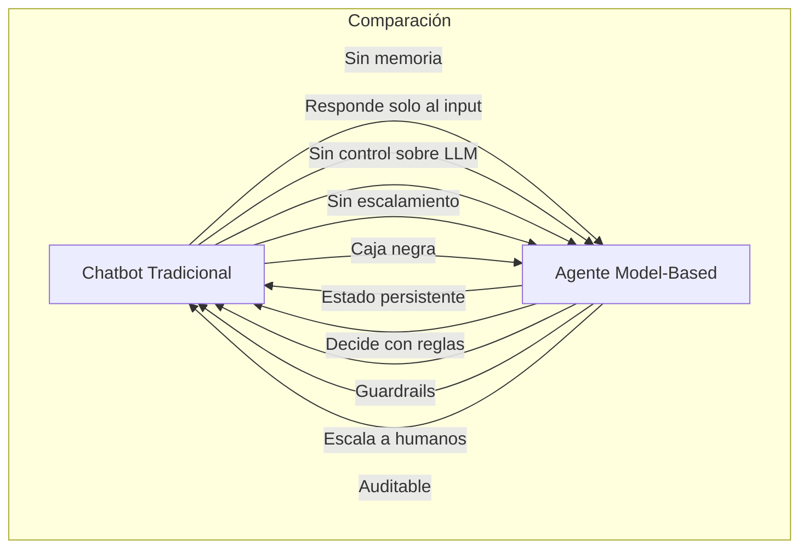
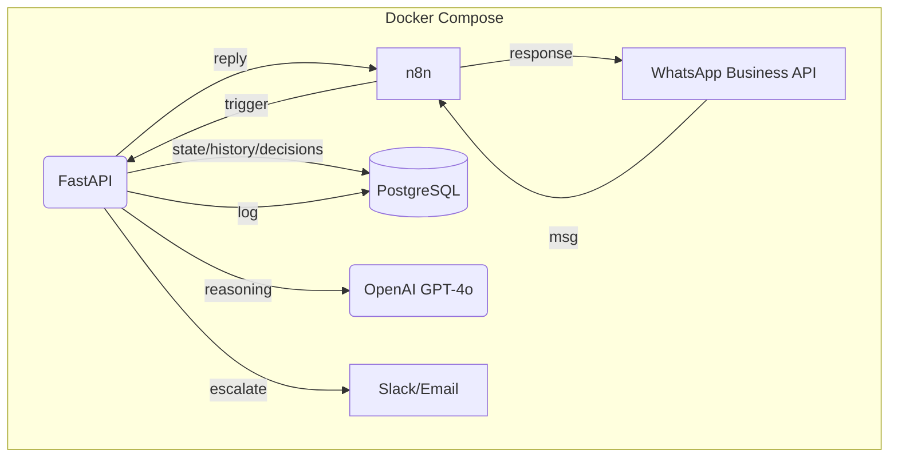
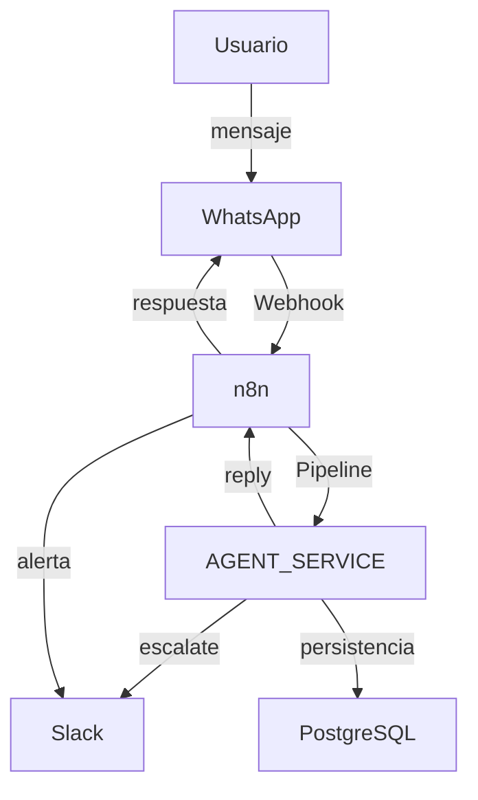
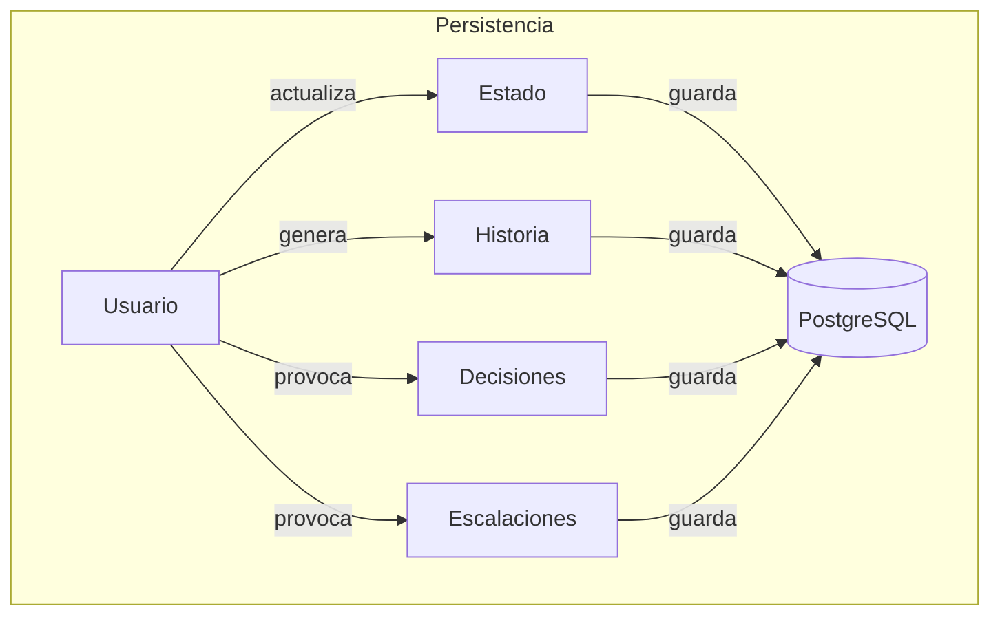
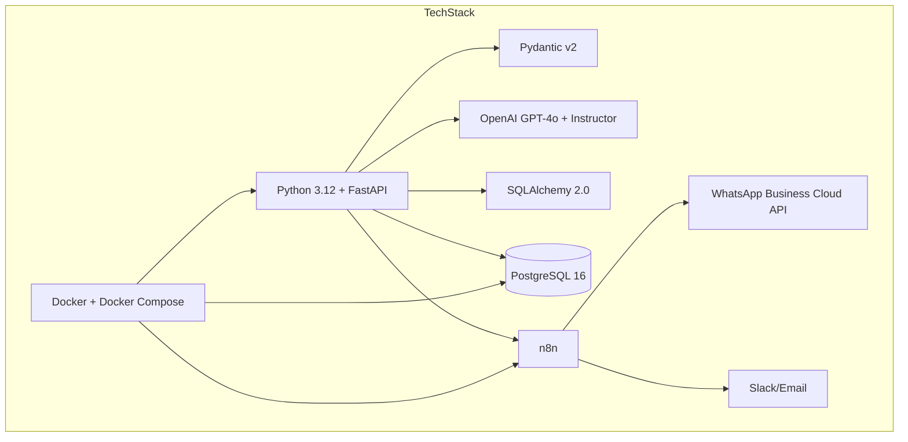

# 🤖 Model-Based AI Agent

Agente de IA basado en modelos con estado persistente, orquestación n8n y canal WhatsApp Business. Este agente no es un chatbot tradicional: **razona, recuerda y decide** usando un modelo mental del usuario, reglas y LLM, con escalamiento inteligente a humanos.

[Arquitectura](#-arquitectura) • [Quick Start](#-quick-start) • [Cómo Funciona](#-cómo-funciona) • [API Reference](#-api-reference) • [Configuración](#%EF%B8%8F-configuración) • [Roadmap](#-roadmap)

---

## 📋 Tabla de Contenidos

- [Descripción](#-descripción)
- [¿Por qué un agente basado en modelos?](#-por-qué-un-agente-basado-en-modelos)
- [Comparación: Chatbot vs Agente](#-comparación-chatbot-vs-agente)
- [Arquitectura](#-arquitectura)
- [Flujo de Datos](#-flujo-de-datos)
- [Pipeline de Decisión](#-pipeline-de-decisión)
- [Persistencia de Estado](#-persistencia-de-estado)
- [Tech Stack](#-tech-stack)
- [Quick Start](#-quick-start)
- [Roadmap](#-roadmap)
- [Contribución](#-contribución)
- [Licencia](#-licencia)

---

## 📖 Descripción

**Model-Based AI Agent** es un sistema de agente inteligente que mantiene un **modelo interno del mundo** (estado del usuario, contexto, hechos conocidos), toma **decisiones estructuradas** basadas en reglas y LLM, y escala a humanos cuando es necesario. El estado, la historia y las decisiones se almacenan en PostgreSQL, permitiendo trazabilidad y auditoría total.

| Característica | Descripción |
|---|---|
| 🧠 **Estado persistente** | Modelo mental del usuario almacenado en PostgreSQL |
| ⚡ **Decisiones estructuradas** | Salida JSON validada con Pydantic + Instructor |
| 🛡️ **Guardrails deterministas** | Reglas pre-LLM y post-LLM que controlan al agente |
| 👤 **Human-in-the-Loop** | Escalamiento automático con contexto completo |
| 📊 **Observabilidad total** | Cada decisión queda logueada y auditable |
| 🔄 **Orquestación n8n** | Flujos visuales para integrar canales y servicios |
| 📱 **WhatsApp nativo** | Canal de entrada/salida vía Business Cloud API |
| 🐳 **100% containerizado** | Docker Compose para desarrollo y producción |

---

## 🤔 ¿Por qué un agente basado en modelos?

El agente implementa el patrón *Model-Based Reflex Agent* de Russell & Norvig, manteniendo un modelo interno del mundo para tomar mejores decisiones y escalar a humanos cuando es necesario.

---

## 🆚 Comparación: Chatbot vs Agente



---

## 🏗 Arquitectura



---

## 🔄 Flujo de Datos



---

## 🧩 Pipeline de Decisión

```mermaid
flowchart TD
    subgraph Pipeline
        Perception[1. Perception]
        StateManager[2. State Manager]
        PreLLM[3. Pre-LLM Rules]
        Reasoner[4. Reasoner (LLM)]
        PostLLM[5. Post-LLM Rules]
        ActionSelect[6. Action Select]
        Persist[7. Persist]
        Log[8. Log]
    end
    Perception-->StateManager-->PreLLM-->Reasoner-->PostLLM-->ActionSelect-->Persist-->Log
```

---

## 🗄️ Persistencia de Estado



---

## 🛠 Tech Stack



---

## 🚀 Quick Start

### Prerrequisitos

- [Docker](https://docs.docker.com/get-docker/) 20.10+
- [Docker Compose](https://docs.docker.com/compose/install/) 2.0+
- API Key de OpenAI (o proveedor LLM compatible)
- Credenciales de WhatsApp Business API

### 1. Clonar el repositorio

```bash
git clone https://github.com/mmendeza-beep/ideal-journey.git
cd ideal-journey
```

### 2. Configurar variables de entorno

Edita el archivo `.env` con tus credenciales y configuración.

### 3. Levantar los servicios

```bash
docker-compose up --build
```

### 4. Acceder a los servicios

- FastAPI: http://localhost:8000
- n8n: http://localhost:5678

---

## 🛣️ Roadmap

- Integración con más canales (Telegram, Web)
- Mejoras en la observabilidad y métricas
- Políticas de decisión personalizables
- Plugins para nuevos dominios

---

## 🤝 Contribución

¡Las contribuciones son bienvenidas! Abre un issue o PR para sugerencias y mejoras.

---

## 📄 Licencia

Este proyecto está bajo la licencia MIT.

